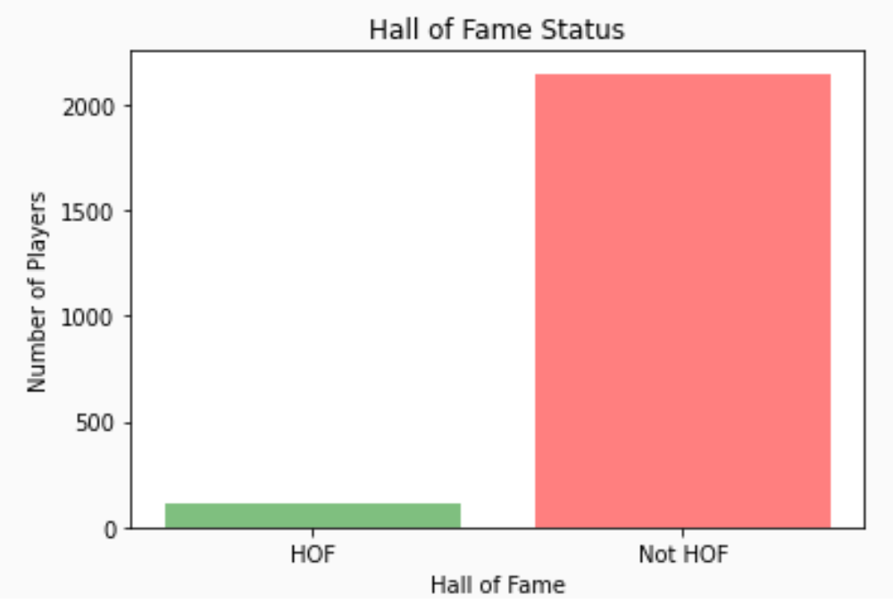
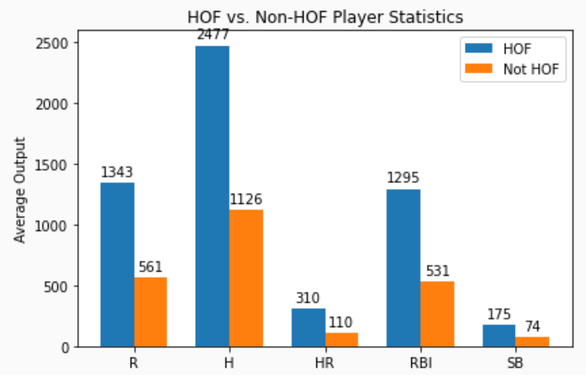

#  Baseball Hall of Fame

###  Eryk Wdowiak and Ken Hoffman

This project uses the [Lahman Baseball Database](http://www.seanlahman.com/baseball-archive/statistics) to identify
the career statistics which predict a player's probability of having been inducted into the Baseball Hall of Fame.

##  Who gets inducted?

Very few players get inducted into the Hall of Fame.  Under current criteria, five years after retirement, a player
who played 10 or more seasons in the major leagues is eligible for a vote by the Baseball Writers' Association of
America, but not every player gets a vote.  Among those who do, few receive enough votes for induction.

In the Lahman Database, we identified 2258 eligible players who retired after 1945.  Of those, only 120 have been inducted.

On the mound, a low Earned Run Average and lots of Strikeouts and Wins make a Pitcher more likely to have been inducted into
the Baseball Hall of Fame.  Behind the plate, Catchers who made more PutOuts and Catch Stealing more base runners are more
likely to have been inducted.

In the infield, batting statistics become a better predictor of induction, while fielding statistics remain important too.
Specifically, Infielders who made more Double Plays are more likely to have been inducted, while their total Runs and
Runs Batted In are also important predictors of induction.

And in the outfield, run production was one of the most important factors which predicts induction.  Outfielders who
scored more Runs and produced more Runs Batted In are more likely to have been inducted.

##  Modelling Hall of Famers

To identify the features associated with a player's odds of having been inducted, we estimated logistic a set of
logistic regressions for each of the four position categories:  Pitchers, Catchers, Infielders and Outfielders.
In developing those models, we tried to find the model which would provide the most explanatory power with
the fewest number of features.  Our experiments identified the features described above.

##  Predicting Hall of Famers

Given that a gambling business may wish to sell "futures" on a player's induction, we also split our data
into training and test sets so that we could train a classifier that predicts induction of future players.

Because only five percent of eligible players have been inducted, our first step in predicting induction was to
oversample the inducted players with SMOTE, so that our training data would consist of a one (synthetic) inducted
player for every eight non-inducted players.

##  Powerpoint Slides

https://docs.google.com/presentation/d/13Gnsu-9SvZcb8EUmxB_qbz3dVeUPHlr3oqji6ug5qR0/edit?usp=sharing

